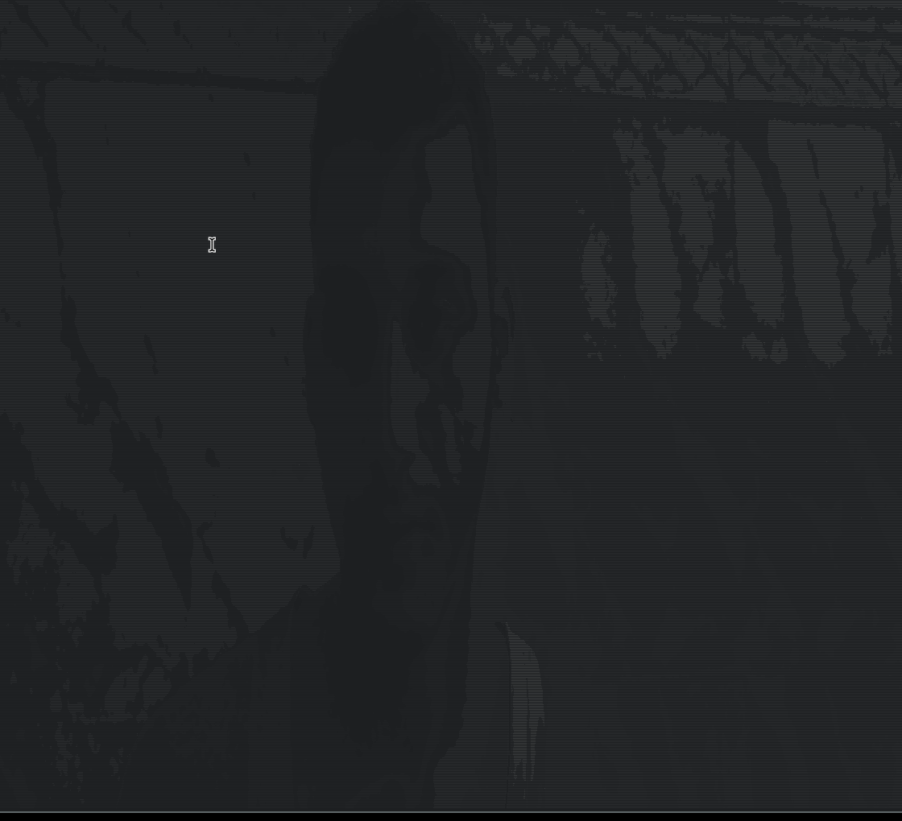

# Vic To Ascii
takes ur Vic (video, image , camera capture) removes the colors and slaps some ascii chars to replace it.      


# How To Use 
-   if the terminal output doesnt work that means u are using the wrong terminal, this app was tested on alacritty.
-   by default Victa only handles imgs ant its uses stbi to load them.    
    -   ```
        $ ./run.sh
        $ ./Victa -h
        ```

-   if u want to use video features u need to use opencv 
    -   make sure u have opencv installed or install it **apt install libopencv-dev**
    -   make sure u minimize ur terminal before to see full output, it will seem random when its zoomed in
    -   ```
            $ ./run.sh -opencv
            $ ./Victa -h
            $ ./Victa -cap-frame ; read          # capture a frame print it and wait for input
            $ ./Victa -cap                       # capture stream this will fill ur terminal
        ``` 

# Dependencies
-   stb_image , stb_truetype , stb_image_write: stb is a great afing libary thkx to [nothings](https://github.com/nothings/)
-   opencv, if u want to use videos u got have opencv, does all the heavy lifting, good stuff   

# Dev Imgs
## Img To Ascii     
     
## Capture-Frame To Ascii    
     
## Capture Camera To Ascii    
     
## Video To Ascii    
     
     


LICSESE FOR FONT